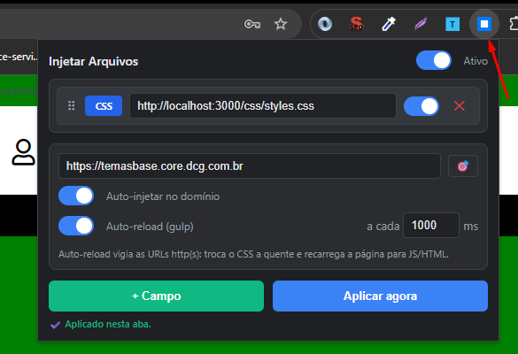

# Injetar Arquivos Locais

Extensão para **Chrome / Edge** (Manifest V3) que injeta arquivos **CSS, JS e HTML** em qualquer página, por **URL** (ex: seu servidor local do `gulp`). Ideal para desenvolver e testar mudanças direto em um site em produção sem precisar de deploy.

- ✅ **Auto-detecção de tipo** pela extensão do arquivo (`.css`, `.js`, `.html`) — sem escolher manualmente
- ✅ **Injeção de HTML** em qualquer seletor CSS da página (no fim, no início ou substituindo)
- ✅ **Auto-reload** que observa o servidor local (`gulp watch`) e recarrega/atualiza sozinho
- ✅ **Domínio base**: a extensão só age no site que você definir
- ✅ **Reordenar por arrastar**, ativar/desativar cada arquivo e liga/desliga geral
- ✅ Configuração persistida em `chrome.storage.local`

---

## 📸 Visão geral

<!-- IMAGEM: screenshot do popup inteiro aberto -->


---

## 🚀 Instalação

1. Baixe/clone este repositório:
   ```bash
   git clone https://github.com/thiamaco-lc/injetar-arquivos-locais.git
   ```
2. Abra `chrome://extensions` (ou `edge://extensions`).
3. Ative o **Modo do desenvolvedor** (canto superior direito).
4. Clique em **Carregar sem compactação** e selecione a pasta do projeto.
5. Fixe a extensão na barra para acesso rápido.

<!-- IMAGEM: página chrome://extensions com a extensão carregada -->
<!--  -->

---

## 🧩 Como usar

### 1. Defina o domínio base (obrigatório)

A extensão **só injeta no domínio que você definir** — sem domínio, ela não age em nenhum site. Isso evita que os arquivos vazem para páginas que não são a sua.

- Digite o domínio (ex: `http://localhost:3000`) **ou** clique no **🎯** para preencher com o domínio da aba atual.

> 🗂️ **Cada domínio tem seu próprio perfil.** Os arquivos e as configurações (auto-inject, auto-reload) são salvos **por domínio**. Ao trocar o domínio, a lista recarrega os arquivos daquele domínio — nada é compartilhado entre sites diferentes. Ao abrir o popup, ele já mostra o perfil do site da aba atual.

<!-- IMAGEM: área de configuração destacando o campo de domínio e o botão 🎯 -->
<!--  -->

### 2. Adicione os arquivos

Clique em **+ Campo** e cole a URL do arquivo. O **tipo é detectado automaticamente** pela extensão:

| Termina em        | Tipo detectado | Como é injetado                              |
|-------------------|----------------|----------------------------------------------|
| `.css`            | **CSS**        | `<link>` no `<head>`                          |
| `.js` / `.mjs`    | **JS**         | `<script src>` no fim do `<body>`             |
| `.html` / `.htm`  | **HTML**       | Inserido no seletor que você escolher         |

- Não detectou? Clique no **badge de tipo** para forçar (`CSS` → `JS` → `HTML`).
- Use o **✕** para remover e o **⠿** para **arrastar e reordenar** a ordem de injeção.
- O **toggle** de cada linha ativa/desativa aquele arquivo individualmente.

<!-- IMAGEM: uma linha de arquivo destacando badge de tipo, campo de URL, toggle e ícones -->
<!--  -->

### 3. Injeção de HTML com seletor

Quando o tipo é **HTML**, aparecem campos extras:

- **Seletor** — onde inserir (ex: `body`, `#app`, `.header`).
- **Onde** — `no fim`, `no início` ou `substituir` o conteúdo do alvo.

<!-- IMAGEM: linha de HTML mostrando o campo de seletor e o select de posição -->
<!--  -->

> 💡 Os arquivos são sempre referenciados por **URL** (ex: `http://localhost:3000/...`), servida pelo seu ambiente local (`gulp`, `webpack`, etc.). Isso funciona com o CSP dos sites e habilita o auto-reload.

### 4. Auto-injetar no domínio

Com **Auto-injetar no domínio** ligado, os arquivos são reinjetados sozinhos toda vez que você abrir ou recarregar uma página do domínio base.

### 5. Auto-reload (gulp watch)

Ligue o **Auto-reload** para a extensão observar os arquivos servidos (URLs `http`/`https`) e reagir quando o `gulp` recompilar:

- **CSS** → troca a folha de estilo **a quente** (sem recarregar a página).
- **JS / HTML** → **recarrega a página** automaticamente.

Ajuste o intervalo de verificação em milissegundos (padrão `1000`).

<!-- IMAGEM: área de configuração destacando os toggles Auto-injetar e Auto-reload + intervalo -->
<!--  -->

---

## 💡 Exemplos

### Sobrescrever o CSS de um site com o seu tema local

1. Domínio base: `https://meusite.com`
2. Arquivo: `http://localhost:3000/css/tema.css`  → detecta **CSS**
3. Ligue **Auto-reload** e rode `gulp watch` — cada save no `.scss` atualiza o site na hora.

### Injetar um script de testes

- Domínio base: `https://meusite.com`
- Arquivo: `http://localhost:3000/js/LinxApi.js`  → detecta **JS**

### Inserir um banner de HTML no topo da página

- Arquivo: `http://localhost:3000/banner.html`  → detecta **HTML**
- Seletor: `body` · Posição: **no início**

---

## ⚙️ Como funciona (resumo técnico)

- **`popup.html` / `popup.js`** — interface e configuração (salva em `chrome.storage.local`, um perfil por domínio).
- **`background.js`** (service worker) — centraliza a injeção e faz os `fetch` de arquivos (evita CORS entre a página e o `localhost`), além de rodar o watcher do auto-reload.
- CSS entra como `<link>`, JS como `<script src>` e HTML é buscado e inserido no seletor escolhido.

---

## 🔒 Permissões usadas

| Permissão          | Para quê                                                        |
|--------------------|----------------------------------------------------------------|
| `scripting`        | Injetar CSS/JS/HTML na página                                   |
| `storage`          | Salvar a configuração dos arquivos (por domínio)               |
| `tabs` / `activeTab` | Saber a aba/URL atual                                        |
| `<all_urls>`       | Buscar arquivos e injetar em qualquer domínio que você definir |

---

## 📄 Licença

[MIT](LICENSE)
